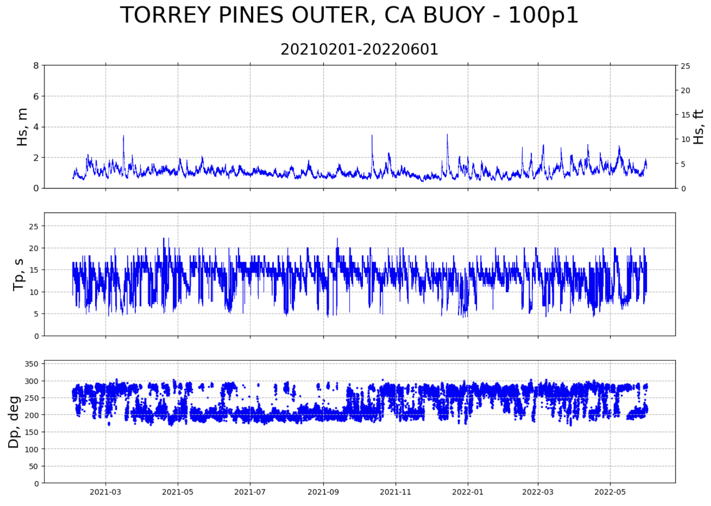
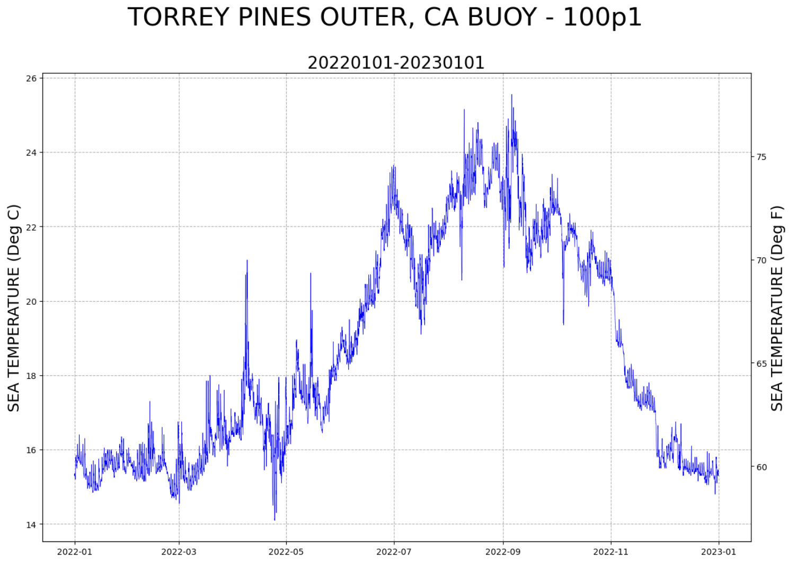
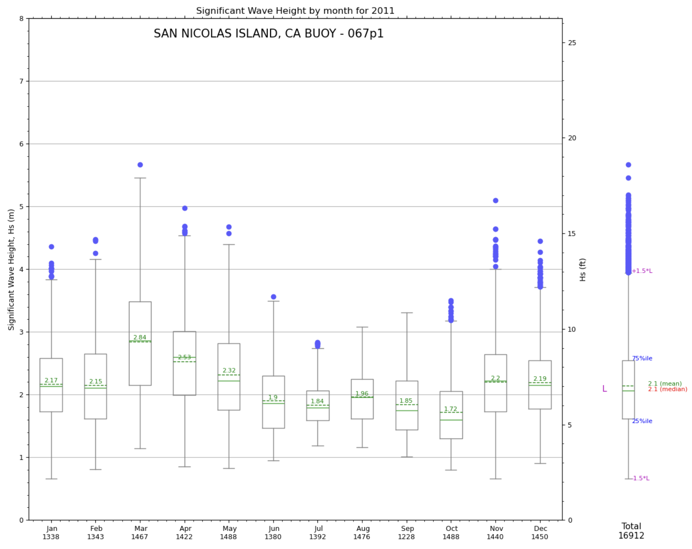
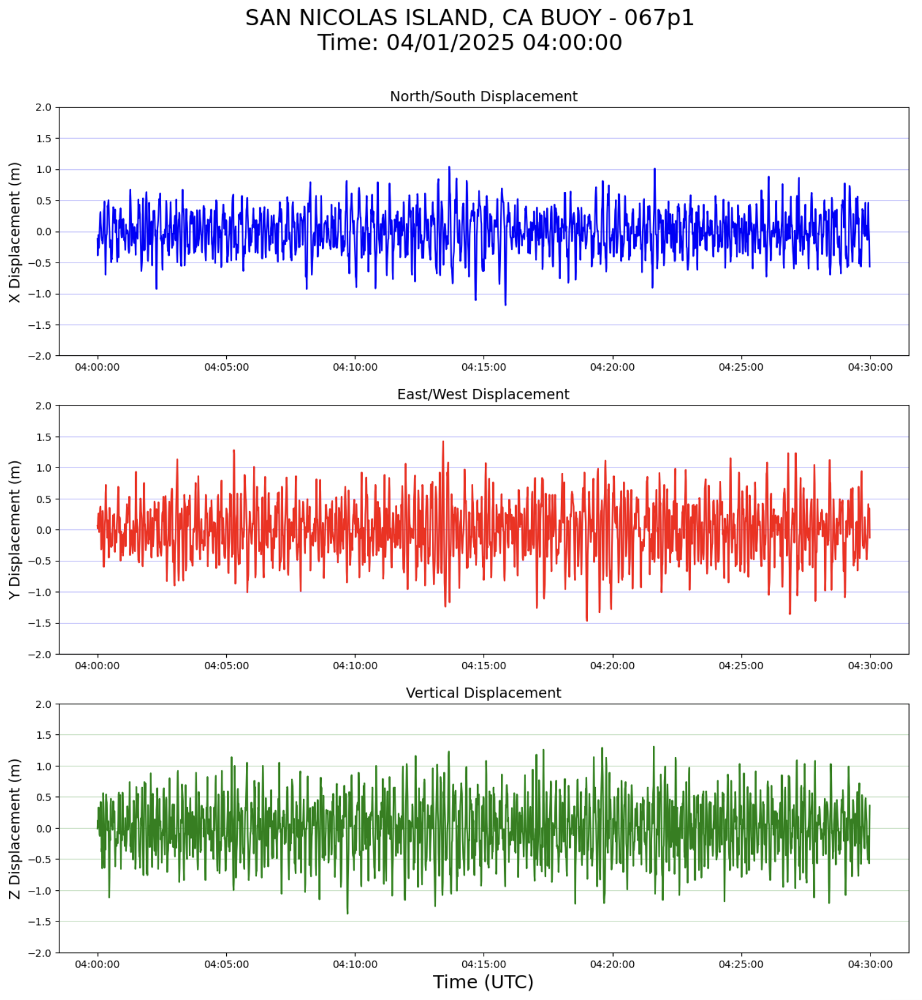
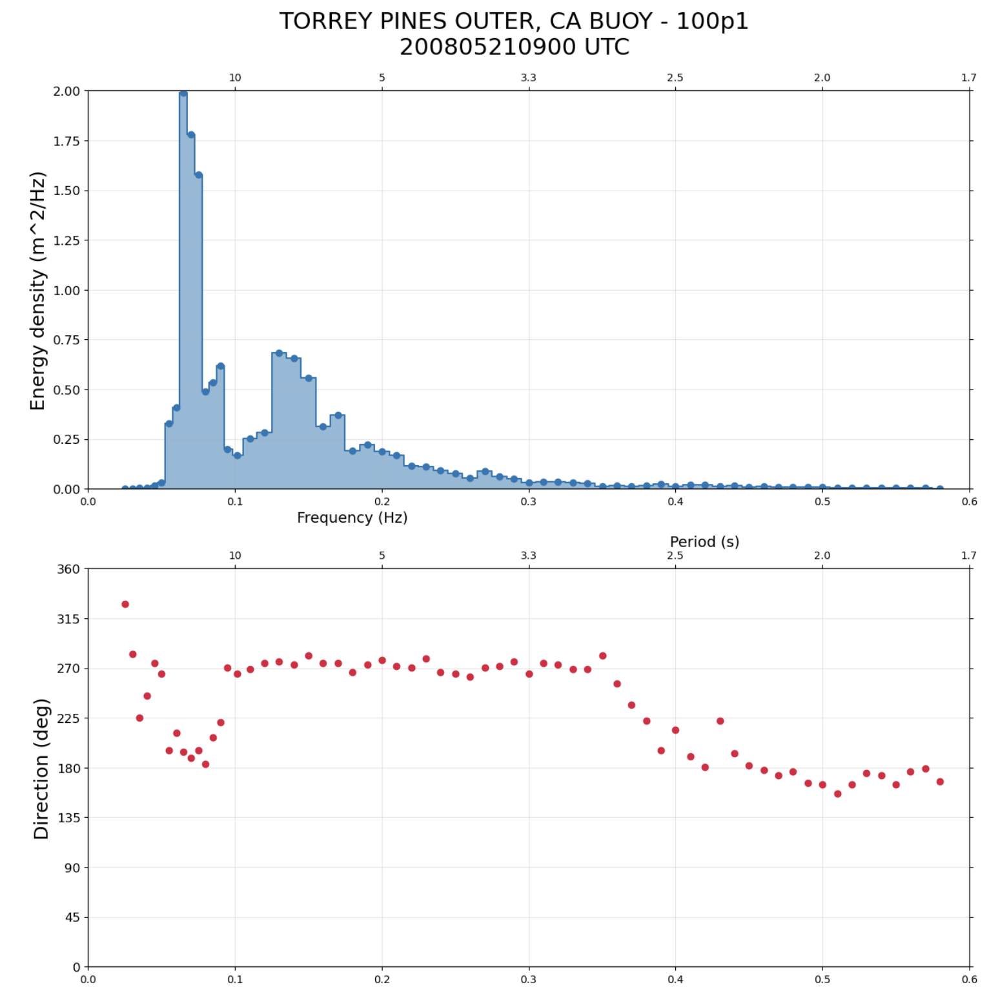
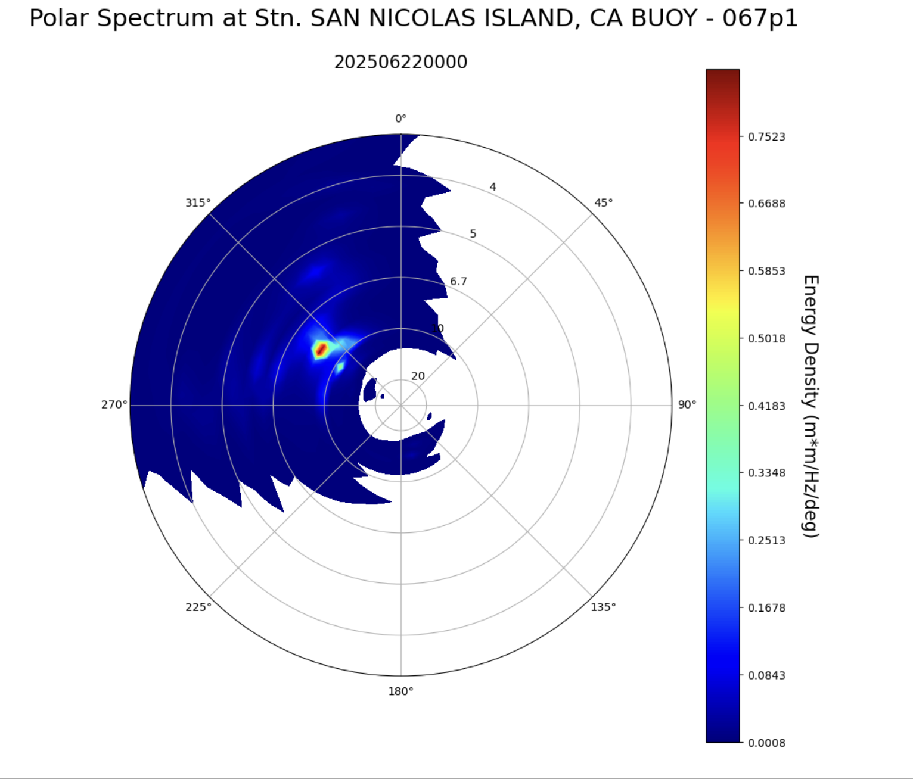

Examples
========
Examples of CDIPpy to access CDIP data and reproduce CDIP web products.

Notebooks
---------

Python examples are available as Jupyter notebooks.

Table below describes what can be found within each interactive notebook

| Thumbnail | Title | Description | Notebook |
|-----------|-------|-------------|----------|
|  | **Compendium Plot** | Visualize common CDIP parameters over time | [`cdippy-compendium.ipynb`](gcdippy-compendium.ipynb) |
|  | **Sea Surface Temperature Plot** | Visualize CDIP SST over time | [`cdippy-sst.ipynb`](gcdippy-sst.ipynb) |
|  | **Wave Height Seasonal Boxplot** | Compute statistics and visualize CDIP wave heights | [`cdippy-boxplot.ipynb`](gcdippy-boxplot.ipynb) |
|  | **XYZ Displacements Plot** | Access and visualize CDIP xyz displacement data | [`cdippy-xyz.ipynb`](gcdippy-xyz.ipynb) |
|  | **Wave Spectrum 1D Plot** | Access and visualize CDIP 1-D wave spectra data | [`cdippy-spectrum1d.ipynb`](gcdippy-spectrum1d.ipynb) |
|  | **Wave Spectrum 2D Plot** | Access and visualize CDIP 2-D wave spectra data | [`cdippy-spectrum2d.ipynb`](gcdippy-spectrum2d.ipynb) |

